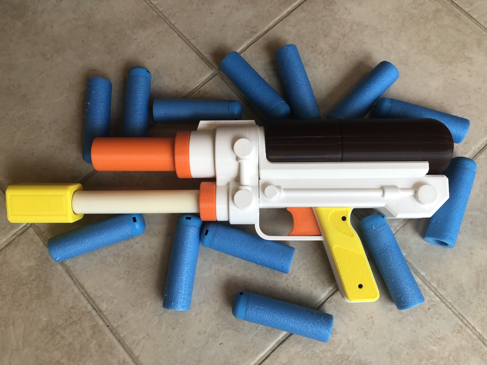
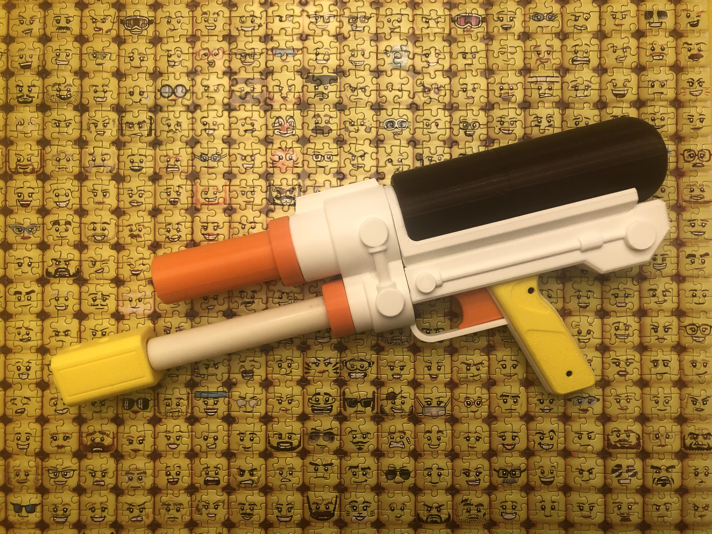

# SillyMaxx 1400

## Description

Basic assembly guide: https://youtu.be/TCJiuXc-gHQ

Firing demo: https://www.youtube.com/watch?v=Evi2LHyZtMM

MegaXL Performance: 115 avg out of Trivictus barrel, 12 pumps (stock Titan OPRV goes off at 12).

## Tank and Pump Minimization

To be used in the SillyMaxx 1400 design, a stock Titan tank and Titan pump need to be slightly minimized. These minimizations do not increase the power of the blaster, they just make the tank and pump slightly slimmer. 

## Print Info

All STLs were exported in print orientation. STEP and F3D are also provided.

Some parts need brims, a lot of parts need supports. This blaster is NOT as cleanly printed as my other designs.

I recommend rafts for the BodyBlockA and BodyBlockB parts, to keep them straight, and to make the supports easier to remove. I use Cura tree supports. 

The smaller parts (Trigger bits, tank pipe parts, the front cover rings, modules for the top of the faux tank, grip panels etc) should be printed at high infill. I did them at 20% gyroid infill, 4 walls.

The MegaXL barrels included in the fileset should be printed at 5 walls, at least 20% infill. 

The large parts (BodyBlockA,B,C, Faux Tank, Frontblock, etc) and the pump grip can be printed at lower infill and wall count. I did them at 5-10% gyroid infill, 3 walls. 

## Misc.

**If you make any of my designs, I'd love to see yours! Feel free to message me on Discord (Sillybutts#5905) or tag me on a post on Reddit (u/SillyTheGamer).**

**If you are having issues with any of my designs, let me know on Discord (Sillybutts#5905) or Reddit (u/SillyTheGamer).**

**If you wish to print and sell this item, please contact me for licensing. I can be reached on Discord (Sillybutts#5905) or Reddit (u/SillyTheGamer).**

 This work is licensed under a <a rel="license" href="http://creativecommons.org/licenses/by-nc-sa/4.0/">Creative Commons Attribution-NonCommercial-ShareAlike 4.0 International License</a>.

## If you like what I do, please consider supporting me!

**I don't charge for my files, so any donations or merch purchases would be greatly appreciated!**

 https://www.redbubble.com/people/Sillybutts/shop RedBubble full of fun Nerf-y sticker and merch designs!  

 https://www.patreon.com/sillybutts Monthly donations

 https://www.buymeacoffee.com/sillybutts One-time donations

## Images

